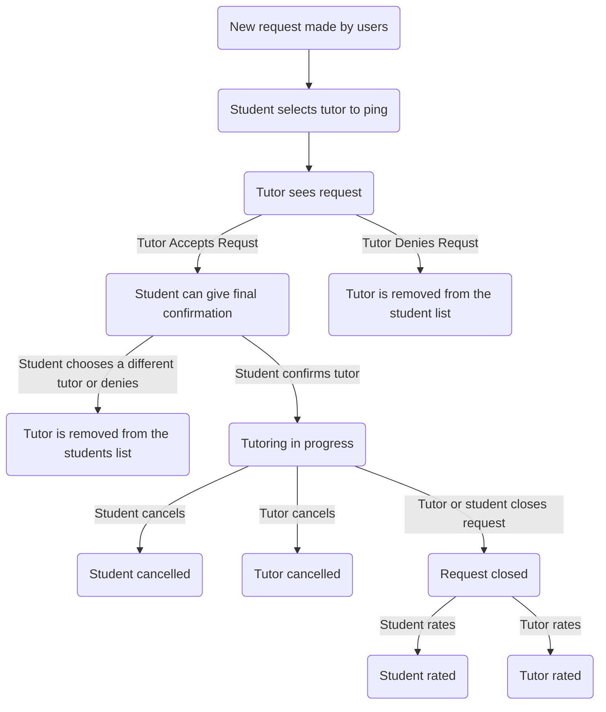

# Request Lifecycle

Below are the diagrams for request lifecycle. The first is the old diagram and if you click a node it will link you to a section telling you the status and the state. The same will be true of the second diagram which is the proposed changes to the request lifecycle.

## Old Diagram

Here is a simple flow chart:

### New request made
* status: open
* state: OPENED

### Tutor sees request
* status: open
* state: CHECKING

### Tutor accepted
* status: open
* state: ACCEPT

### Tutor denied
* status: open
* state: DENY

### Tutoring in progress
* status: tutoring
* state: ACCEPT

### Student canceled
* status: deny
* state: ACCEPT

### Tutor canceled
* status: tutoring
* state: DENY

### Request closed
* status: closed
* state: ACCEPT

### Student rated
* status: rated
* state: ACCEPT

### Tutor rated
* status: closed
* state: RATED

## New Diagram

```mermaid
stateDiagram-v2
    state "START" as start
    
    state "Request: <br/> <pre> status: 'open' <br/> state: 'OPENED' <br/> student: 'student_id' <br/> tutor: null <br/> pinged_tutors: [empty] <br/> accepted_tutors: [empty] <br/> denied_tutors: [empty] <br/> cancelled_tutors: [empty] <br/> stu_rating: null <br/> tut_rating: null </pre>" as newReq
    
    state "Request: <br/> <pre> status: 'close' <br/> state: 'CANCELLED OPENED' <br/> student: 'student_id' <br/> tutor: null <br/> pinged_tutors: [empty] <br/> accepted_tutors: [empty] <br/> denied_tutors: [empty] <br/> cancelled_tutors: [empty] <br/> stu_rating: null <br/> tut_rating: null </pre>" as newReqCancelled
    
    state "Request: <br/> <pre> status: 'open' <br/> state: 'CHECKING' <br/> student: 'student_id' <br/> tutor: null <br/> pinged_tutors: [tutorA_id, tutorB_id] <br/> accepted_tutors: [empty] <br/> denied_tutors: [empty] <br/> cancelled_tutors: [empty] <br/> stu_rating: null <br/> tut_rating: null </pre>" as pingedReq
    
    state "Request: <br/> <pre> status: 'close' <br/> state: 'CANCELLED CHECKING' <br/> student: 'student_id' <br/> tutor: null <br/> pinged_tutors: [tutorA_id, tutorB_id] <br/> accepted_tutors: [empty] <br/> denied_tutors: [empty] <br/> cancelled_tutors: [empty] <br/> stu_rating: null <br/> tut_rating: null </pre>" as pingedReqCancelled
    
    state "Request: <br/> <pre> status: 'open' <br/> state: 'CHECKING' <br/> student: 'student_id' <br/> tutor: null <br/> pinged_tutors: [tutorA_id, tutorB_id] <br/> accepted_tutors: [tutorA_id] <br/> denied_tutors: [empty] <br/> cancelled_tutors: [empty] <br/> stu_rating: null <br/> tut_rating: null </pre>" as tutorAAccept
    
    state "Request: <br/> <pre> status: 'close' <br/> state: 'CANCELLED CHECKING' <br/> student: 'student_id' <br/> tutor: null <br/> pinged_tutors: [tutorA_id, tutorB_id] <br/> accepted_tutors: [tutorA_id] <br/> denied_tutors: [empty] <br/> cancelled_tutors: [empty] <br/> stu_rating: null <br/> tut_rating: null </pre> <hr/> <i>Note: Tutor 'A' no longer sees request.</i>" as tutorAAcceptStuCancelled
    
    state "Request: <br/> <pre> status: 'open' <br/> state: 'CHECKING' <br/> student: 'student_id' <br/> tutor: null <br/> pinged_tutors: [tutorA_id, tutorB_id] <br/> accepted_tutors: [empty] <br/> denied_tutors: [empty] <br/> cancelled_tutors: [tutorA_id] <br/> stu_rating: null <br/> tut_rating: null </pre> <hr/> <i>Note: Student sees tutor 'A' denied. Student <br/> must continue request with some other tutor.</i>" as tutorAAcceptTutACancelled
    
    state "Request: <br/> <pre> status: 'open' <br/> state: 'CHECKING' <br/> student: 'student_id' <br/> tutor: null <br/> pinged_tutors: [tutorA_id, tutorB_id] <br/> accepted_tutors: [empty] <br/> denied_tutors: [tutorA_id] <br/> cancelled_tutors: [empty] <br/> stu_rating: null <br/> tut_rating: null </pre> <hr/> <i>Note: Tutor 'A' no longer sees request in their <br/> Student Requests list.</i>" as tutorADeny
    
    state "Request: <br/> <pre> status: 'open' <br/> state: 'CHECKING' <br/> student: 'student_id' <br/> tutor: null <br/> pinged_tutors: [tutorA_id, tutorB_id] <br/> accepted_tutors: [tutorA_id, tutorB_id] <br/> denied_tutors: [empty] <br/> cancelled_tutors: [empty] <br/> stu_rating: null <br/> tut_rating: null </pre>" as tutorBAccept
    
    state "Request: <br/> <pre> status: 'open' <br/> state: 'ASSIGNED' <br/> student: 'student_id' <br/> tutor: 'tutorA_id' <br/> pinged_tutors: [tutorA_id, tutorB_id] <br/> accepted_tutors: [tutorA_id, tutorB_id] <br/> denied_tutors: [empty] <br/> cancelled_tutors: [empty] <br/> stu_rating: null <br/> tut_rating: null </pre> <hr/> <i>Note: Tutor 'B' no longer sees request in their <br/> Student Requests list.</i>" as tutorASelected
    
    state "Request: <br/> <pre> status: 'close' <br/> state: 'CANCELLED ASSIGNED' <br/> student: 'student_id' <br/> tutor: 'tutorA_id' <br/> pinged_tutors: [tutorA_id, tutorB_id] <br/> accepted_tutors: [tutorA_id, tutorB_id] <br/> denied_tutors: [empty] <br/> cancelled_tutors: [empty] <br/> stu_rating: null <br/> tut_rating: null </pre> <hr/> <i>Note: Tutor 'A' is informed of the cancellation <br/> and no longer sees the request.</i>" as tutorASelectedStuCancelled
    
    state "Request: <br/> <pre> status: 'open' <br/> state: 'ASSIGNED' <br/> student: 'student_id' <br/> tutor: null <br/> pinged_tutors: [tutorA_id, tutorB_id] <br/> accepted_tutors: [tutorA_id, tutorB_id] <br/> denied_tutors: [empty] <br/> cancelled_tutors: [tutorA_id] <br/> stu_rating: null <br/> tut_rating: null </pre> <hr/> <i>Note: Student is informed and must proceed <br/> request with a different tutor.</i>" as tutorASelectedTutACancelled
    
    state "Request: <br/> <pre> status: 'open' <br/> state: 'FULFILLED' <br/> student: 'student_id' <br/> tutor: 'tutorA_id' <br/> pinged_tutors: [tutorA_id, tutorB_id] <br/> accepted_tutors: [tutorA_id, tutorB_id] <br/> denied_tutors: [empty] <br/> cancelled_tutors: [empty] <br/> stu_rating: null <br/> tut_rating: null </pre> <hr/> <i>Note: Student and tutor 'A' both see request <br/> with rating question.</i>" as reqFulfilled
    
    state "Request: <br/> <pre> status: 'open' <br/> state: 'FULFILLED' <br/> student: 'student_id' <br/> tutor: 'tutorA_id' <br/> pinged_tutors: [tutorA_id, tutorB_id] <br/> accepted_tutors: [tutorA_id, tutorB_id] <br/> denied_tutors: [empty] <br/> cancelled_tutors: [empty] <br/> stu_rating: rating# <br/> tut_rating: null </pre> <hr/> <i>Note: Student no longer sees request.</i>" as reqRatedStudent
    
    state "Request: <br/> <pre> status: 'open' <br/> state: 'FULFILLED' <br/> student: 'student_id' <br/> tutor: 'tutorA_id' <br/> pinged_tutors: [tutorA_id, tutorB_id] <br/> accepted_tutors: [tutorA_id, tutorB_id] <br/> denied_tutors: [empty] <br/> cancelled_tutors: [empty] <br/> stu_rating: null <br/> tut_rating: rating# </pre> <hr/> <i>Note: Tutor 'A' no longer sees request.</i>" as reqRatedTutor
    
    state "Request: <br/> <pre> status: 'open' <br/> state: 'FULFILLED' <br/> student: 'student_id' <br/> tutor: 'tutorA_id' <br/> pinged_tutors: [tutorA_id, tutorB_id] <br/> accepted_tutors: [tutorA_id, tutorB_id] <br/> denied_tutors: [empty] <br/> cancelled_tutors: [empty] <br/> stu_rating: rating# <br/> tut_rating: rating# </pre> <hr/> <i>Note: Neither user can see request now.</i>" as reqRatedBoth
    
    state "Request: <br/> <pre> status: 'close' <br/> state: 'FULFILLED' <br/> student: 'student_id' <br/> tutor: 'tutorA_id' <br/> pinged_tutors: [tutorA_id, tutorB_id] <br/> accepted_tutors: [tutorA_id, tutorB_id] <br/> denied_tutors: [empty] <br/> cancelled_tutors: [empty] <br/> stu_rating: rating# <br/> tut_rating: rating# </pre>" as reqClosed
    
    start --> newReq: Student opens new request.
    newReq --> pingedReq: Student selects tutors 'A' and 'B' to ping.
    pingedReq --> tutorAAccept: Some tutor 'A' accepts request.
    pingedReq --> tutorADeny: Tutor 'A' denies request.
    tutorAAccept --> tutorBAccept: Some other tutor 'B' also accepts the request.
    
    tutorBAccept --> tutorASelected: Student selects tutor 'A' to fulfill request.
    
    tutorASelected --> reqFulfilled: Student and tutor 'A' proceed with tutoring and student marks request as completed.
    reqFulfilled --> reqRatedStudent: Student rates request.
    reqFulfilled --> reqRatedTutor: Tutor rates request.
    reqRatedStudent --> reqRatedBoth: Tutor rates request.
    reqRatedTutor --> reqRatedBoth: Student rates request.
    reqRatedBoth --> reqClosed: Request is finished and closed once both ratings are in.
    
    newReq --> newReqCancelled: Student cancels request.
    pingedReq --> pingedReqCancelled: Student cancels request.
    
    tutorAAccept --> tutorAAcceptStuCancelled: Student cancels request.
    tutorAAccept --> tutorAAcceptTutACancelled: Tutor 'A' cancels acceptance.
    
    tutorASelected --> tutorASelectedStuCancelled: Student cancels request.
    tutorASelected --> tutorASelectedTutACancelled: Tutor 'A' cancels acceptance.
    
    
```

### Cancellation Cases
 * If tutor is not in accepted list and is in cancelled list, they cancelled before being selected by the student.
 * If tutor is in accepted list AND in cancelled list, tutor cancelled after student selected them to be tutored by.
 * If `state` begins with `CANCELLED`, the request was cancelled by the student at whatever stage is the word following `CANCELLED`.
 * Deleted requests are requests with `status` `close` and a `state` beginning with the word `CANCELLED`.

### Requests for Users
 * Keep list of "pointers" to requests up to a week prior for each student for request history
 * For browsing student requests on tutor view, query database everytime to load page
 * Student can check for tutors in two ways:
    * `Check for tutors` button on request which queries database for recommended tutors and displays tutors, which the student can ping with the current request autoselected
    * `Browse tutors` page, which displays all tutors, and student can select which request they want to ping for before pining a tutor
    * Both of the above pages will be generated fresh on each load by querying the database
    * Each request possesses a `pinged_tutors` list, which will always be displayed with the tutor acceptance status inside the request
