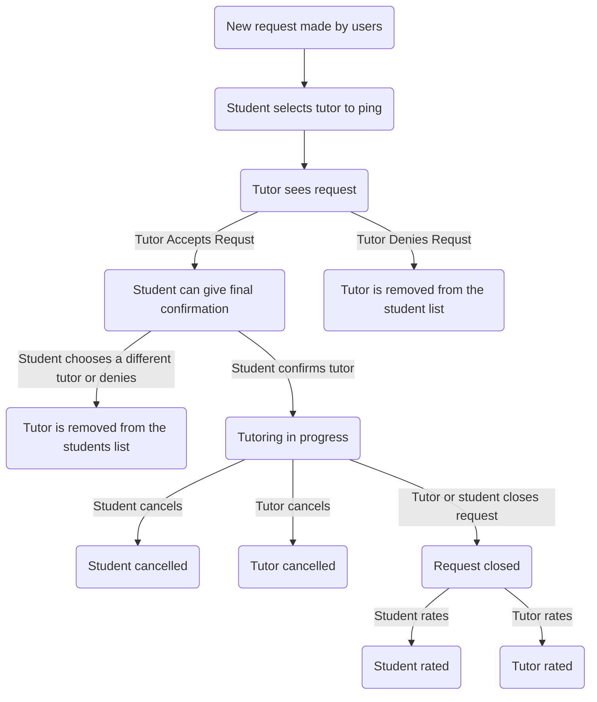

# Request Lifecycle

Below are the diagrams for request lifecycle. The first is the old diagram and if you click a node it will link you to a section telling you the status and the state. The same will be true of the second diagram which is the proposed changes to the request lifecycle.

## Old Diagram

Here is a simple flow chart:

### New request made
* status: open

### Tutor sees request
* status: open
* state: CHECKING

### Tutor accepted
* status: open
* state: ACCEPT

### Tutor denied
* status: open
* state: DENY

### Tutoring in progress
* status: tutoring
* state: ACCEPT

### Student canceled
* status: deny
* state: ACCEPT

### Tutor canceled
* status: tutoring
* state: DENY

### Request closed
* status: closed
* state: ACCEPT

### Student rated
* status: rated
* state: ACCEPT

### Tutor rated
* status: closed
* state: RATED
