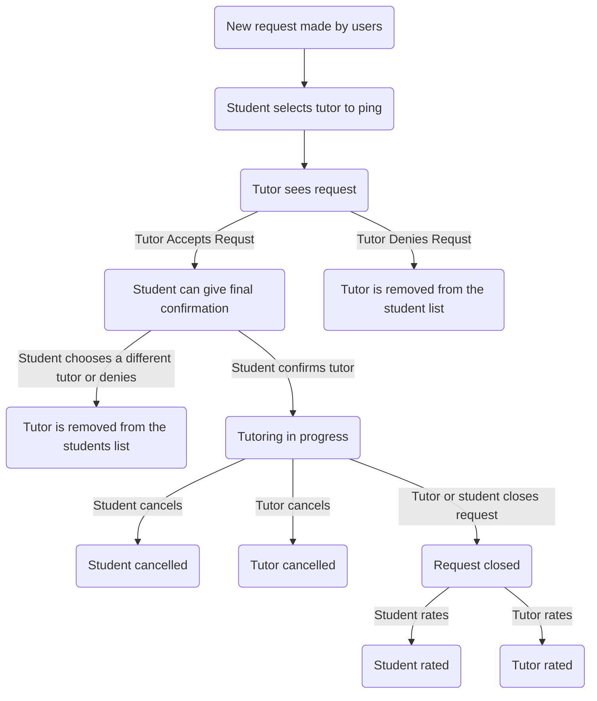

# Request Lifecycle

## Old Diagram

Here is a simple flow chart:

### New request made
status: open

### Tutor sees request
status: open

state: CHECKING

### Tutor accepted
status: open

state: ACCEPT

### Tutor denied
status: open

state: DENY

### Tutoring in progress
status: tutoring

state: ACCEPT

### Student cancels
status: deny

state: ACCEPT

### Tutor cancels
status: tutoring

state: DENY

### Request closed
status: closed

state: ACCEPT

### Student rates
status: rated

state: ACCEPT

### Tutor rates
status: closed

state: RATED
